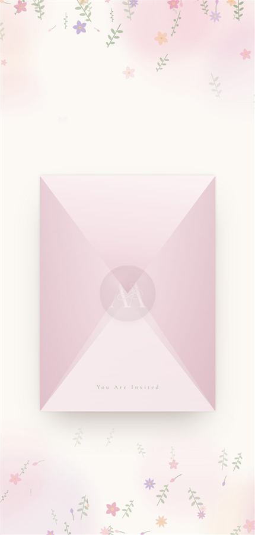
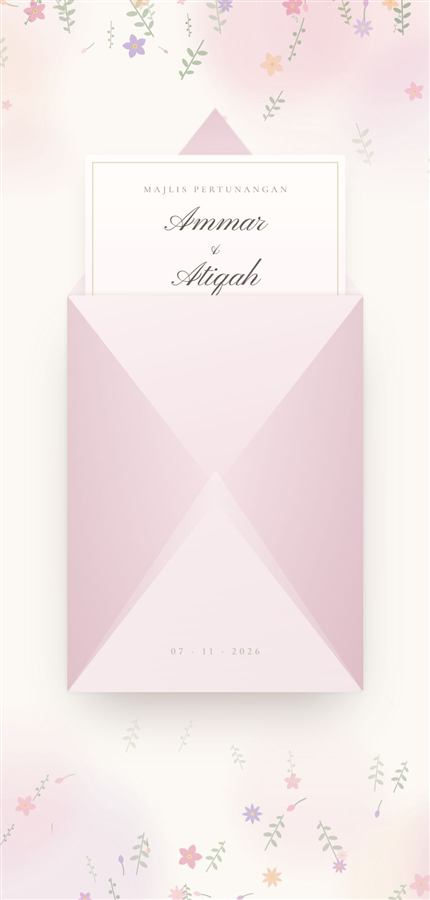

# 01 · Portrait envelope with a wax stamp

  

A portrait envelope sealed at its centre with a wax stamp pressed with the
couple's monogram. One tap: the seal fades away, the flap opens, a letter bearing the names
rises out, and the envelope dissolves into the invitation.

**Live:** https://ammar25-02.github.io/Wedding/ · **Source:** `index.html`

## The sequence

| Time | What happens | Class added |
|---|---|---|
| 0 ms | Seal fades out (0.6 s); hint fades; **music starts** | `.broken` on `#gate` |
| 620 ms | Flap swings up and back | `.opening` |
| 1100 ms | Flap drops behind the letter | `.flap-behind` on `#flapHold` |
| 1450 ms | Letter rises out of the pocket | `.lifted` |
| 3200 ms | Envelope fades; page becomes scrollable | `.away`, body loses `.sealed` |
| 4300 ms | Envelope hidden outright | `.gone` |

With *Reduce Motion* switched on, the same steps run faster and things fade
instead of moving.

## Lifting it into another project

Search `index.html` for these three banners and copy each block:

1. **CSS** — `The envelope` / `Portrait, seen from the back` … up to `.reveal{`
2. **Markup** — the `<div class="gate" id="gate">` block, just after `<body>`
3. **JavaScript** — `/* ---------- the envelope ---------- */` … up to `/* ---------- scroll cue ---------- */`

Also needed:

- `<body class="sealed">` — stops the page scrolling until the envelope opens
- `logo.png` — the monogram (make one with the [converter](https://ammar25-02.github.io/Wedding/tools/logo-converter.html))
- The colour tokens (`--paper`, `--ink`, `--ink-soft`, `--gold`, `--sage`) and
  the `--vh` unit from the top of the stylesheet
- The `$` helper, the `reduced` flag and `startSong()` from the script. If
  there's no music, delete the `startSong();` line.

The letter fills itself from the `INVITE` block (`majlis`, `nama1`, `nama2`,
`coverTarikh`) through `data-f` attributes — see
[building-blocks.md](building-blocks.md#the-invite-block).

## Things you can change

| What | Where | Default |
|---|---|---|
| Envelope width | `--ew` on `.gate` | `min(72vw, 296px, 40svh)` |
| Envelope proportion | `--eh` on `.gate` | `--ew × 1.34` (portrait) |
| Seal size | `--seal` on `.gate` | `clamp(78px, --ew × .32, 104px)` |
| Wax colour | `.seal-face, .seal-half` background | `#624550` → `#876570`, mauve |
| Monogram on the wax | `.seal img` — `width`, `filter`, `opacity` | 68 % wide, pale cream, embossed |
| How far the letter rises | `.lifted .letter` | `translateY(-52%)` |
| Date on the envelope | `.env-date` text in the markup | `07 · 11 · 2026` |
| Timing | the `setTimeout` delays in `openEnvelope()` | see table above |

### Changing the wax colour

The seal has three shades. Keep them in the same family, darkest last:

```css
radial-gradient(40% 34% at 33% 27%, rgba(201,165,175,.85) 0%, rgba(201,165,175,0) 62%),  /* shine */
radial-gradient(118% 118% at 64% 80%, #624550 0%, #876570 60%);                          /* body  */
```

For a classic red wax: shine `rgba(214,120,138,.85)`, body `#792336` → `#9E3348`.

## How it works

- **The monogram on the wax** is the same `logo.png`, turned pale with
  `filter: brightness(0) invert(1) sepia(.18)` and given a dark edge above and a
  light edge below with two `drop-shadow`s. That's what makes it look pressed in.
- **The seal fades.** On the tap `.broken` is added and the seal face's
  opacity transitions to 0 over 0.6 s (`.seal-face{transition:opacity .6s ease}`).
  Change `.6s` to make it quicker or slower. The flap starts opening at 620 ms,
  just as the seal finishes.
- **Want the crack back?** The earlier animation — the seal splitting in two,
  one initial on each half — is in git history at commit `ba2211c`. Copy the
  `@keyframes crackL` / `crackR` block and the two `.broken .seal-half`
  lines from there, and remove the `.seal-face` transition so it hides at once.
- **The flap** is a clipped triangle rotated `rotateX(-172deg)` inside a
  parent with `perspective`. The parent — not `preserve-3d` — carries the 3D, so
  ordinary `z-index` still decides what's in front. Halfway through the swing
  the flap is moved behind the letter.
- **The envelope sits low on the screen** (`padding-top` on `.gate`) because the
  opened flap and the rising letter both need room above it.

## Gotchas

- The seal is sized with the `--seal` length on **both** axes. `aspect-ratio`
  would be neater but needs Safari 15 — on older iPhones the seal vanished. A
  percentage `height` doesn't work either: it measures the envelope's height and
  comes out oval.
- After it fades, the envelope gets `visibility:hidden`. Without that it sits
  invisibly over the page and swallows every tap.
- More in [lessons.md](lessons.md).
