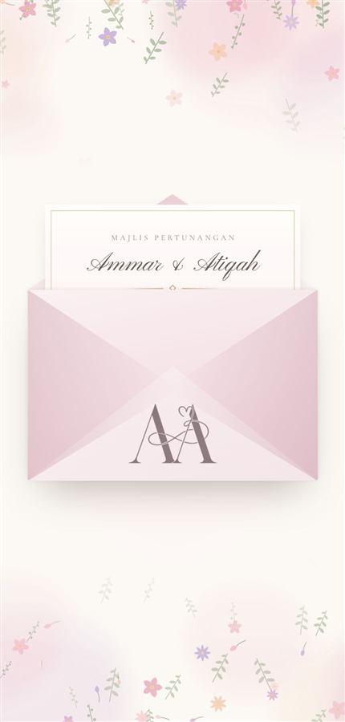

# 02 · Landscape envelope, monogram on the face

 

A landscape envelope with the monogram printed on its face, no seal. One tap:
the flap opens, a letter bearing the names rises out, and the envelope
dissolves into the invitation. Simpler and calmer than the wax stamp.

**Demo:** [designs/envelope-landscape.html](https://ammar25-02.github.io/Wedding/designs/envelope-landscape.html) ·
**Source commit:** `0ee080e`

## The sequence

| Time | What happens | Class added |
|---|---|---|
| 0 ms | Flap opens; hint fades; **music starts** | `.opening` on `#gate` |
| 480 ms | Flap drops behind the letter | `.flap-behind` |
| 950 ms | Letter rises | `.lifted` |
| 2600 ms | Envelope fades; page scrolls | `.away`, body loses `.sealed` |
| 3700 ms | Envelope hidden | `.gone` |

## Lifting it into another project

In `designs/envelope-landscape.html`, copy:

1. **CSS** — the banner `The envelope` / `A landscape envelope seen from the back` … up to `.reveal{`
2. **Markup** — `
`
3. **JavaScript** — `/* ---------- the envelope ---------- */`

It needs the same supporting pieces as [01](01-envelope-stamp.md#lifting-it-into-another-project):
`<body class="sealed">`, `logo.png`, the colour tokens, `$`, `reduced` and
`startSong()`.

**Swapping it for the current portrait envelope:** replace those three blocks
in `index.html` with these. The class names match, so nothing else changes.

## Things you can change

| What | Where | Default |
|---|---|---|
| Envelope width | `--ew` on `.gate` | `min(84vw, 380px, 64svh)` |
| Proportion | `--eh` | `--ew × .66` (landscape) |
| Monogram size / position | `.env-mark` | 31 % wide, 9 % from the bottom |
| Flap depth | `.flap` height | 52 % |
| Letter rise | `.lifted .letter` | `translateY(-62%)` |

## Notes

- The monogram sits **below the point of the flap**, so it stays visible while
  the letter rises behind it. If you enlarge it, check the flap's point
  (52 % down) doesn't cover its top.
- For a landscape envelope, the letter is landscape too: its wording sits at
  the top so that's the part that clears the pocket.
