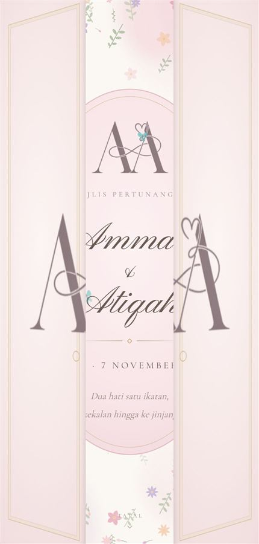

# 03 · Double doors with a split monogram

 

Two blush doors with gilded panels and ring pulls. The monogram is cut exactly
down the seam, one half on each door, so tapping parts the initials as the
doors swing open in 3D to reveal the invitation behind.

**Demo:** [designs/doors.html](https://ammar25-02.github.io/Wedding/designs/doors.html) · **Source commit:** `798d713`

## The sequence

| Time | What happens |
|---|---|
| 0 ms | Doors start swinging (`.open`); **music starts** |
| 1100 ms | Page becomes scrollable (body loses `.sealed`) |
| 2200 ms | Doors hidden outright (`.gone`) |

The swing itself takes 2.1 s.

## Lifting it into another project

In `designs/doors.html`, copy:

1. **CSS** — the banner `The doors` … up to `.reveal{`
2. **Markup** — `<div class="doors" id="doors">`
3. **JavaScript** — `/* ---------- the doors ---------- */` … up to `/* ---------- scroll cue ---------- */`

Plus `<body class="sealed">`, `logo.png`, the colour tokens, `$`, `reduced` and
`startSong()` — as in [01](01-envelope-stamp.md#lifting-it-into-another-project).

## The one number you must update

The split works by showing each door a half-width window onto a full-size copy
of the logo. For the two halves to meet exactly, the CSS needs the logo's
proportion:

```css
--logo-h: calc(var(--logo-w) / 1.4737);   /* the logo's width ÷ height */
```

**Change `1.4737` whenever you change `logo.png`.** The
[converter](https://ammar25-02.github.io/Wedding/tools/logo-converter.html) shows this number as *Ratio* after it
processes an image. Get it wrong and the halves won't line up at the seam.

## Things you can change

| What | Where | Default |
|---|---|---|
| Monogram size | `--logo-w` on `.doors` | `clamp(200px, 64vw, 330px)` |
| How far the doors open | `.open .door.left / .right` | `rotateY(∓104deg)` |
| Swing speed | `.door` transition | `2.1s cubic-bezier(.62,.02,.22,1)` |
| Door colour | `.leaf` background | blush radial gradient |
| Gilded panel | `.frame` | inset gold hairline |

## Notes

- Each door is hinged at its **outer** edge (`transform-origin: left` / `right`).
- The perspective is on `.doors`, the doors' parent. Putting
  `transform-style: preserve-3d` on a container instead breaks `z-index`
  stacking — see [lessons.md](lessons.md).
- A monogram with two separate initials (like **A | A**) splits most
  gracefully. A tightly interlocked monogram will cut through its middle
  stroke — test it before choosing this design.
