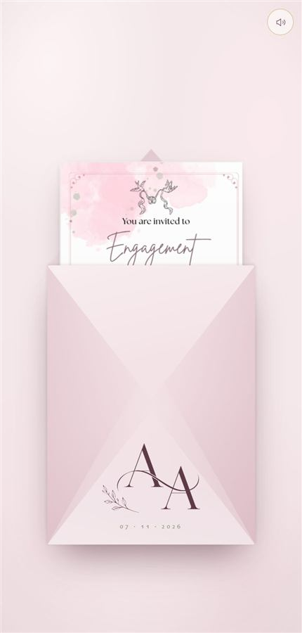
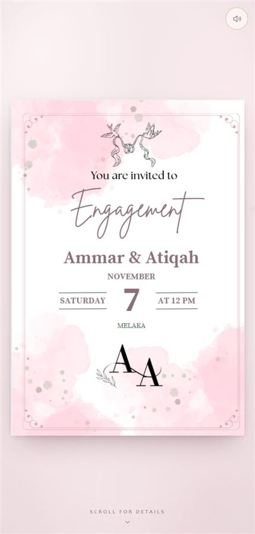
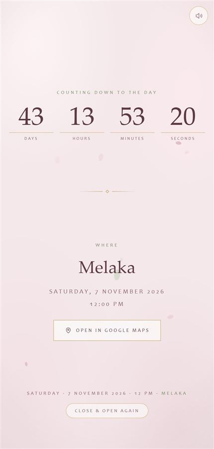
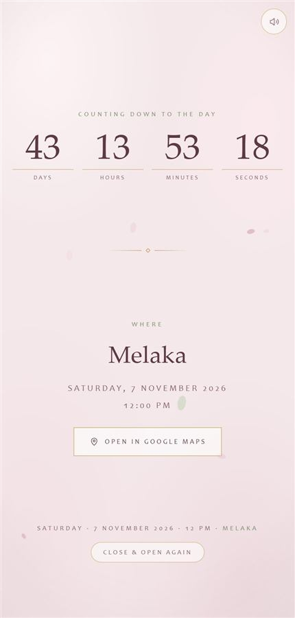

# 04 · Envelope with a printed card

  

 

For when the couple already has a **finished card design as an image** (from
Canva, a designer, etc.). A sealed envelope holds that image; one tap breaks
the wax seal, opens the flap, the card peeks out, then grows to fill the
screen. Below it the page scrolls on to a countdown and a location section.

**Live:** https://ammar25-02.github.io/wedding-Invite/ ·
**Source:** the `wedding-Invite` repo, `index.html`

## The sequence

| Time | What happens |
|---|---|
| 0 ms | Wax seal splits and falls (`.broken`) |
| 500 ms | Flap opens (`.opening`) |
| 940 ms | Flap drops behind the card |
| 1200 ms | Card slides up, peeking out of the pocket; its shadow lifts |
| 2400 ms | Card lifts to the centre of the screen, full size |
| 3800 ms | Page becomes scrollable; countdown starts; petals fall |

Music starts on arrival where the browser allows, otherwise on the first tap.

## Using it with a new card

1. **Save the card as PNG or JPG.** Screenshot quality is fine; ~500 px wide is enough.
2. **Note its proportion** — width ÷ height (e.g. 495 × 712 → `0.6952`).
3. In `index.html`, the card is **embedded** in the page as base64, so the
   page is one self-contained file. Replace the long `data:image/png;base64,…`
   in `` with your image, **or** point `src` at
   a file next to `index.html` (`src="card.png"`) — simpler to update.
4. Set the proportion in **two** places:

```css
--card-ratio: 0.6952;                   /* your card's width ÷ height */
--env-h: calc(var(--env-w) * 1.34);     /* taller cards need a taller envelope */
```

If the card is taller than about 0.70, raise `1.34` until the card clears the
envelope's top edge by a few pixels while sealed — otherwise its top pokes out.

5. Update the countdown target, date line and map link in the script.

## How it works

- **The card is sized by CSS, not measured.** Once lifted it moves into the
  page's normal flow with a width worked out from the screen and
  `--card-ratio`, so rotating the phone or the URL bar collapsing never leaves
  it the wrong size. The lift is animated with a *FLIP*: measure where the card
  is, move it to its final place, measure again, then animate the difference.
- **The card's "still in shadow" tint** is a separate overlay that fades out,
  not a CSS `filter` on the image — a filter repaints the whole card every frame
  and stutters on phones.
- **The monogram on the envelope face** is the same converted `logo.png`.

## Gotchas specific to this design

- **Centring after the lift:** the card uses `left:50%` while inside the
  envelope. Once placed it's `position:relative`, where `left` still applies —
  the placed state must reset it (`left:auto`) or the card lands half a screen
  to the right.
- **The seal and the "tap to open" hint** must be visible on old Safari: no
  `aspect-ratio`, and the hint positioned with `svh`, not `vh` (which put it
  behind the iPhone toolbar).
- More in [lessons.md](lessons.md).
