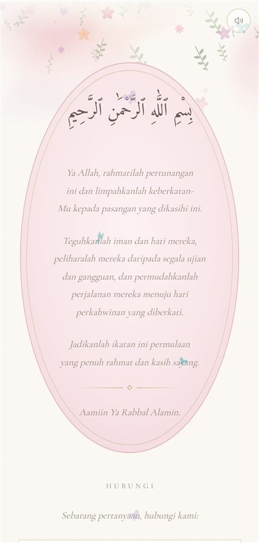
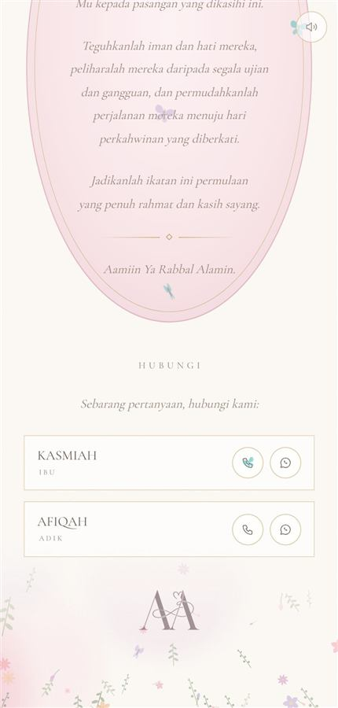

# 06 · Cover, doa and contacts

  

The first and last of the three pages.

**Live:** https://ammar25-02.github.io/Wedding/

## Cover — the oval cartouche

A blush oval with a pink rim and a gold inner hairline. Inside, top to bottom:
the monogram, *Majlis Pertunangan*, the couple's names in script, a gold rule,
the date, and a two-line pantun. Watercolour flowers hang from the top of the
page and grow from the bottom.

- **Markup** — `<!-- ===================== 1 · COVER` in `index.html`
- **CSS** — `Cover cartouche` (`.cartouche`) and `The monogram on the cover`
  (`.crest-mark`)

The oval is an SVG stretched to fill its box
(`preserveAspectRatio="none"`), so it grows with whatever you put inside. Text
near its foot is capped at `max-width:17em` because the oval narrows there —
without that, a long pantun line spills past the edge.

| What | Field / place |
|---|---|
| Heading above the names | `majlis` |
| Names | `nama1`, `nama2` (script face) |
| Date line | `coverTarikh` |
| Pantun | `pantun` — use `<br>` for the line break |
| Monogram size | `.crest-mark` width |

## Doa

The closing prayer, inside the same oval: Bismillah in Amiri, then the doa in
italic. The text is in the markup under `<!-- ===================== 3 · DOA`.
Edit it there directly.

For a **wedding**, swap the engagement prayer for a marriage one — for example
*"Ya Allah, berkatilah pernikahan ini … sakinah, mawaddah dan warahmah."*

## Contacts (Hubungi)


One card per person with a **call** button and a **WhatsApp** button.

```js
hubungi: [
  {nama: 'KASMIAH', peranan: 'IBU',  tel: '0136308182'},
  {nama: 'AFIQAH',  peranan: 'ADIK', tel: '01156930169'}
],
```

- **Numbers in any format work.** The call link keeps only digits and `+`.
  The WhatsApp link turns a leading `0` into Malaysia's `60`
  (`0136308182` → `wa.me/60136308182`).
- **Leave `tel` empty** and that person shows without buttons.
- **Leave the list empty (`[]`)** and the whole Hubungi section disappears.
- For another country, change the `'6'` in `waHref()` to that country code.
