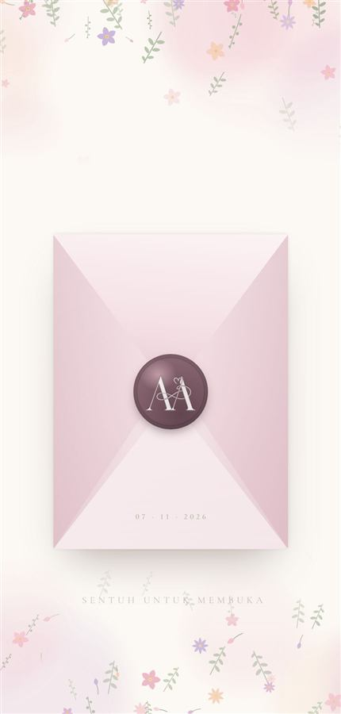
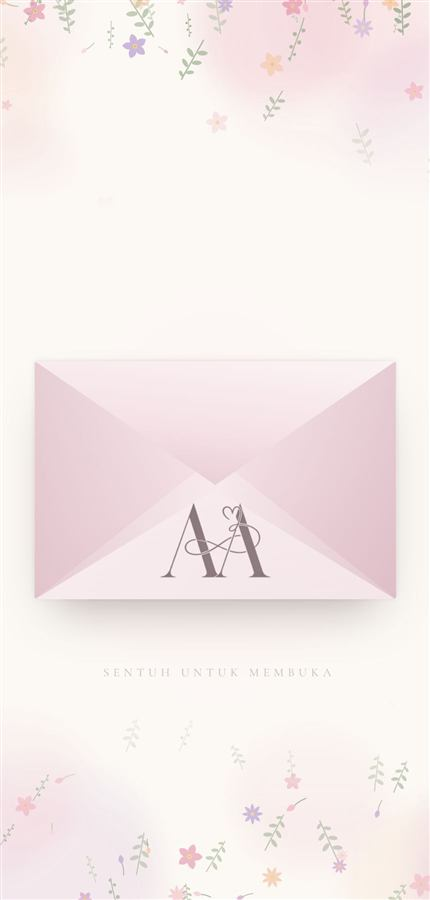
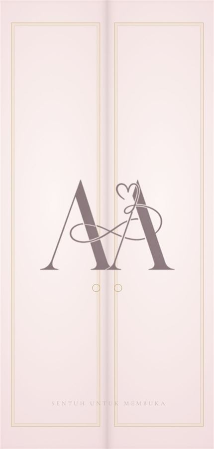
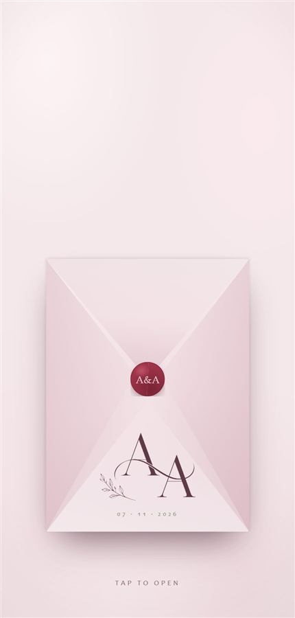
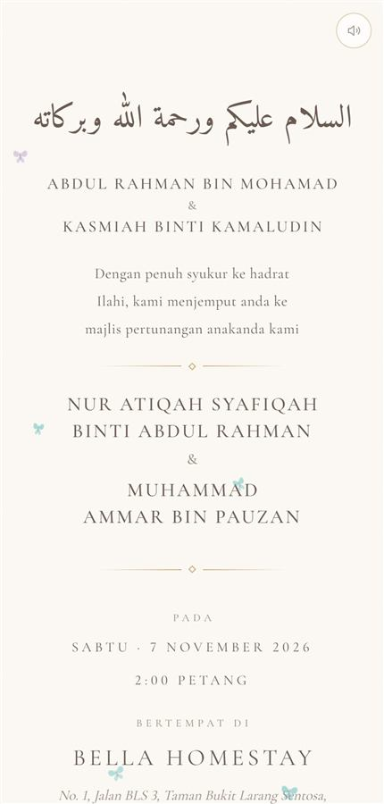
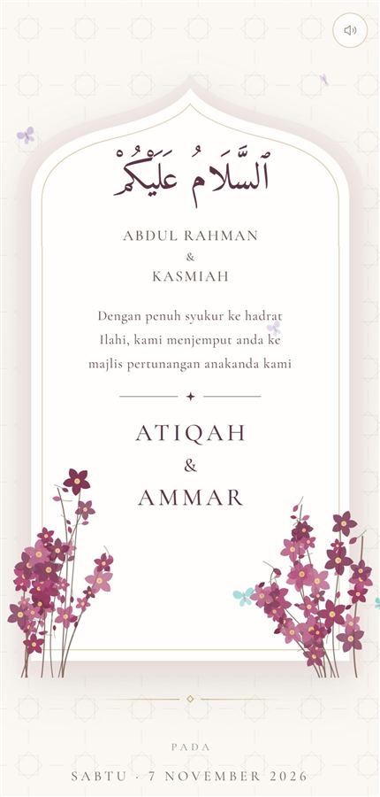
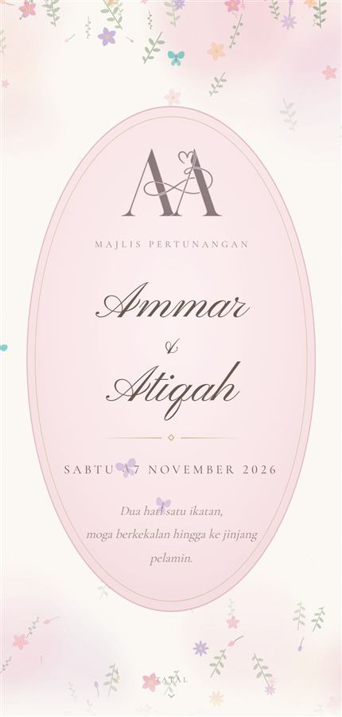
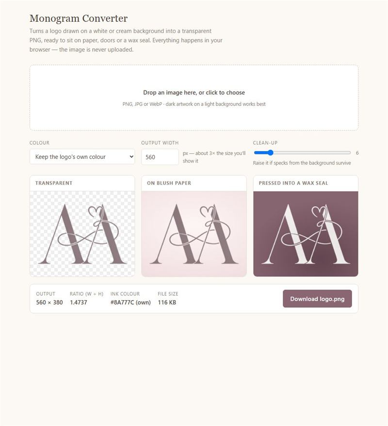

# Invitation Design Library

Every design built for Ammar & Atiqah's invitations, documented so it can be
reused for the next couple. Each design has a working demo you can open, a
guide explaining how it works, and the exact code to lift.

- **Starting a new invitation?** Follow [new-invitation.md](new-invitation.md).
- **Something broke on a phone?** Check [lessons.md](lessons.md) first — most
  problems have already been hit once.

---

## Opening animations

The first thing a guest sees. Each one plays on a single tap, and that tap
also starts the music (phones only allow sound after a tap).

| | Design | Demo | Guide |
|---|---|---|---|
|  | **Portrait envelope, wax stamp** — monogram pressed into a wax seal at the centre; the seal fades, the flap opens, a letter rises. *Current.* | [live](https://ammar25-02.github.io/Wedding/) | [01](01-envelope-stamp.md) |
|  | **Landscape envelope** — monogram printed on the envelope's face; flap opens and a letter rises. | [demo](https://ammar25-02.github.io/Wedding/designs/envelope-landscape.html) | [02](02-envelope-landscape.md) |
|  | **Double doors** — two doors each carrying half the monogram; they swing open in 3D and the initials part. | [demo](https://ammar25-02.github.io/Wedding/designs/doors.html) | [03](03-doors.md) |
|  | **Envelope with a printed card** — uses a finished card *image*: the card rises out and grows to fill the screen. | [live](https://ammar25-02.github.io/wedding-Invite/) | [04](04-card-envelope.md) |

## Invitation pages

What the guest scrolls through after opening.

| | Design | Demo | Guide |
|---|---|---|---|
|  | **Jemputan, plain** — salam, parents, invitation line, couple in capitals, then date, venue, map and countdown. *Current.* | [live](https://ammar25-02.github.io/Wedding/) | [05](05-jemputan.md) |
|  | **Jemputan, mosque arch** — the same wording inside a layered arch frame with plum flowering branches. | [demo](https://ammar25-02.github.io/Wedding/designs/arch-jemputan.html) | [05](05-jemputan.md#mosque-arch-variant) |
|  | **Cover, doa and contacts** — oval cartouche cover, the closing prayer, tap-to-call and WhatsApp contacts. | [live](https://ammar25-02.github.io/Wedding/) | [06](06-pages.md) |

## Shared building blocks

Used by several designs above — [building-blocks.md](building-blocks.md):
the `INVITE` content block, generated watercolour flowers, butterflies,
countdown, music, contact buttons and scroll reveals.

## Tools

| | Tool | Use it for |
|---|---|---|
|  | [**Monogram converter**](https://ammar25-02.github.io/Wedding/tools/logo-converter.html) | Turning a logo on a white or cream background into the transparent `logo.png` every design uses. Keeps the logo's own colour or recolours it, and shows it on paper and on a wax seal before you download. |

---

## Where the code lives

| Path | What it is |
|---|---|
| `index.html` | The live invitation — portrait envelope + three pages. |
| `designs/*.html` | Working snapshots of the retired designs, recovered from git history. Each carries a banner so it's never mistaken for the live page. |
| `tools/logo-converter.html` | The monogram converter. Runs entirely in the browser. |
| `fonts/` | Pinyon Script, Cormorant Garamond, Amiri — self-hosted, SIL Open Font Licence. |
| `logo.png` | The couple's monogram, transparent. |
| `lagu.mp3` | The song. |

Every design is a single HTML file with its CSS and JavaScript inline, and
each section of code starts with a comment banner. The guides tell you which
banners to search for, so you can lift a design without reading the whole file.
